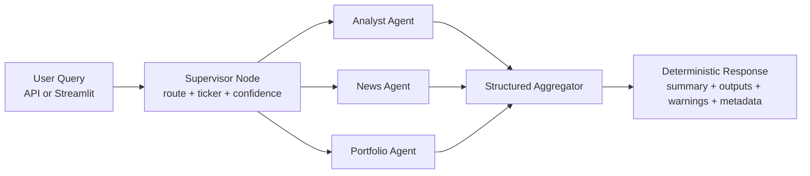

# Multi-Agent Financial Intelligence Platform

Production-style AI orchestration platform for financial intelligence workflows.  
The system routes user questions to specialist agents (analyst, news, portfolio), executes them in parallel, and aggregates outputs into a deterministic response with resilience and diagnostics.

## Why This Platform
- Converts finance Q&A into a modular multi-agent workflow.
- Uses parallel specialist fan-out to reduce end-to-end latency.
- Returns degraded-but-valid output during partial failures.
- Keeps thread-isolated memory for multi-turn sessions.
- Exposes both API and Streamlit interfaces for demo and product iteration.

## Architecture

```text
UI / API Request
    -> Supervisor (structured route decision + ticker + confidence)
    -> Parallel Specialists (analyst, news, portfolio)
    -> Structured Aggregator (executive summary + outputs + warnings + metadata)
    -> Deterministic Platform Response
```

### Architecture Diagram


### Layered Modules
- `app / UI`: Streamlit dashboard (`app.py`)
- `graph orchestration`: `src/fin_platform/graph.py`
- `agents`: `src/fin_platform/agents.py`
- `tools/providers/services`: `src/fin_platform/providers.py`
- `memory`: `src/fin_platform/memory.py`
- `config`: `src/fin_platform/config.py`
- `observability`: `src/fin_platform/observability.py`
- `api`: `src/api/main.py`

## System Flow
1. User submits query with `thread_id`.
2. Supervisor returns typed decision (`routes`, `ticker`, `confidence`, `fallback_reason`).
3. Selected specialists run concurrently with timeout + retry controls.
4. Aggregator composes a consistent response object:
   - `executive_summary`
   - `specialist_outputs`
   - `warnings`
   - `metadata` (latency, completeness, route coverage, confidence)
5. Response is returned even when one or more specialists fail.

## Fault Tolerance
- Specialist failures are isolated and logged.
- Partial failures append warnings without crashing full request.
- Route-level retries are applied with bounded attempts.
- Timeout handling prevents long-tail specialist stalls.

## Data Providers

| Provider | Market data | News sentiment | Portfolio |
|---|---|---|---|
| `MockDataProvider` | Hardcoded snapshot | Labelled mock headlines | Fixed 4-stock demo |
| `YFinanceProvider` | Live prices, SMA20/SMA50 via yfinance | Live headlines + **VADER** polarity scoring | Live prices × 100 shares for AAPL/NVDA/MSFT/TSLA |

Provider selection is controlled by env config (`DATA_MODE`, `ENABLE_LIVE_DATA`).

News sentiment in live mode uses **VADER** (`vaderSentiment`) to classify each headline as `positive`, `negative`, or `neutral` based on compound polarity score — no external API required.

## Setup

```bash
python -m venv venv
venv\Scripts\activate  # Windows
pip install -r requirements.txt
```

### Run API
```bash
uvicorn src.api.main:app --reload --host 127.0.0.1 --port 8000
```

### Run Streamlit
```bash
streamlit run app.py
```

### Run on Custom Port (Recommended if 8000 occupied)
```bash
uvicorn src.api.main:app --reload --host 127.0.0.1 --port 8010
set STREAMLIT_API_BASE_URL=http://127.0.0.1:8010
streamlit run app.py
```

## Mock vs Live Data

Default mode is deterministic mock mode.

### Mock mode
```bash
set DATA_MODE=mock
set ENABLE_LIVE_DATA=false
```

### Live mode (yfinance)
```bash
set DATA_MODE=live
set ENABLE_LIVE_DATA=true
```

Restart API after changing mode flags.

## API Contract

### Endpoints

| Method | Path | Purpose |
|---|---|---|
| `GET` | `/health` | Platform + graph readiness check |
| `GET` | `/metrics` | In-memory counters and p50/p95/p99 latency per operation |
| `POST` | `/query` | Multi-agent financial intelligence query |

### `POST /query`

```json
{
  "query": "Analyze AAPL trend and recent sentiment",
  "thread_id": "demo-thread-1",
  "session_metadata": {"client": "streamlit"},
  "conversation_history": [{"role": "user", "content": "Earlier context"}]
}
```

Returns deterministic structure:
- `executive_summary`
- `specialist_outputs`
- `warnings`
- `metadata`

### Example Health Response
```json
{
  "status": "ok",
  "graph_ready": true,
  "data_mode": "mock"
}
```

### Example Metrics Response (`GET /metrics`)
```json
{
  "counters": {
    "supervisor_calls": 4,
    "analyst_success": 3,
    "news_success": 2
  },
  "timings": {
    "supervisor_ms": { "count": 4, "mean_ms": 1.2, "p50_ms": 1.1, "p95_ms": 1.8, "p99_ms": 1.9 },
    "aggregation_ms": { "count": 4, "mean_ms": 0.4, "p50_ms": 0.3, "p95_ms": 0.6, "p99_ms": 0.6 }
  }
}
```

### Example Multi-Agent Query Response
```json
{
  "executive_summary": "Financial intelligence synthesis for NVDA completed.",
  "specialist_outputs": {
    "analyst": {
      "ticker": "NVDA",
      "technical_trend": "NVDA trend is bullish with SMA20 184.40 vs SMA50 178.10.",
      "price_movement_summary": "Last close 190.20, daily move 1.30%.",
      "indicator_explanation": "SMA20 above SMA50 suggests near-term momentum; gap size indicates trend strength.",
      "confidence": 0.76
    },
    "news": {
      "ticker": "NVDA",
      "headlines": [
        "NVDA launches new enterprise AI feature",
        "NVDA faces antitrust hearing"
      ],
      "sentiment_summary": "News flow is balanced/neutral.",
      "extracted_events": [
        {
          "headline": "NVDA launches new enterprise AI feature",
          "sentiment": "positive",
          "event_type": "product"
        },
        {
          "headline": "NVDA faces antitrust hearing",
          "sentiment": "negative",
          "event_type": "regulatory"
        }
      ],
      "confidence": 0.72
    }
  },
  "warnings": [],
  "metadata": {
    "route_coverage": [
      "analyst",
      "news"
    ],
    "completeness": 1.0,
    "supervisor_confidence": 0.68,
    "latency_ms": 29.04
  }
}
```

## UI Behavior Notes
- Streamlit validates both `/health` and `/query` availability.
- If the API base points to a different app, the UI disables "Run Analysis" and shows a routing/config error instead of crashing.
- Warnings are route-aware: only routed-but-missing specialist outputs are flagged.

## Troubleshooting

### `{"detail":"Not Found"}` on `/query`
Usually indicates Streamlit is pointed to a non-FinAgent service.

```bash
# PowerShell (same terminal before starting Streamlit)
$env:STREAMLIT_API_BASE_URL = "http://127.0.0.1:8010"
python -m streamlit run app.py
```

Verify the target API exposes `/query`:
```bash
Invoke-RestMethod http://127.0.0.1:8010/openapi.json
```

### `ModuleNotFoundError` when starting API
Run with project virtualenv:
```bash
.\venv\Scripts\python -m uvicorn src.api.main:app --reload --host 127.0.0.1 --port 8010
```

### Button disabled in Streamlit
- Confirm API is running and reachable.
- Confirm `STREAMLIT_API_BASE_URL` matches API host/port.
- Confirm `/openapi.json` includes `/query`.

## Testing

```bash
venv\Scripts\python -m pytest -q
```

Coverage includes:
- supervisor routing logic
- specialist agent contracts
- aggregation output + partial failure handling
- provider behavior
- memory/session behavior
- graph service integration

## Demo Queries
- `NVDA trend`
- `NVDA trend and latest news sentiment`
- `Analyze NVDA trend, recent news sentiment, and portfolio concentration risk`

## Docker
Use existing `Dockerfile` and compose workflow; run the same API/UI entrypoints in containers.

## Roadmap
- LLM-based supervisor classifier with strict JSON schema parsing (current: keyword routing).
- Prometheus/OpenTelemetry sink for the `/metrics` counters and timings.
- Broker/execution connectors for authenticated user portfolios (current: live yfinance demo portfolio).
- Advanced risk analytics (factor decomposition, VaR stress scenarios).
