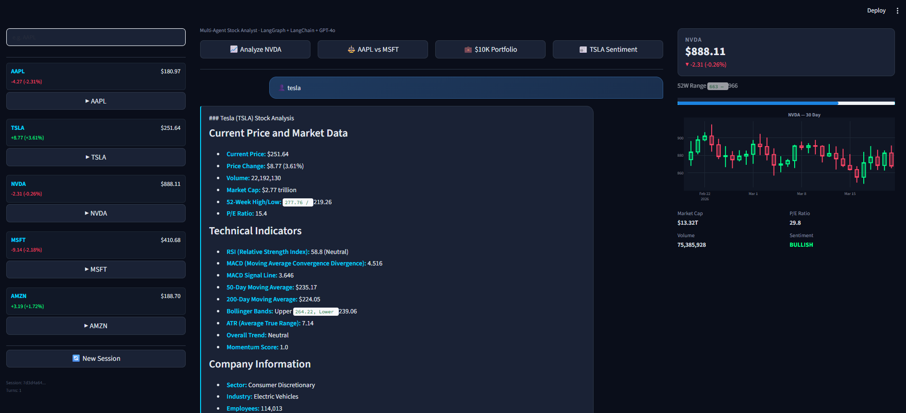

# FinAgent — Multi-Agent Stock Finance Chatbot

The app routes questions through a **LangGraph** supervisor to specialist agents (analyst, news, portfolio), then aggregates answers with **LangChain** (`create_agent` + OpenAI tool calling) and **GPT-4o**. The UI uses a Bloomberg-style dark layout with watchlist, chat, and charts.

Price data uses **yfinance** (real, free market data) with automatic fallback to a deterministic mock layer when live calls are unavailable.

## Screenshots




---

## Requirements

- **Python 3.12+** (recommended)
- **OpenAI API key** ([platform.openai.com](https://platform.openai.com/api-keys))
- **Docker Desktop** (optional, for containerized runs)

---

## Quick start (local)

```bash
# Clone and enter the project
cd finance_agent

# Virtual environment
python -m venv venv

# Windows PowerShell
.\venv\Scripts\Activate.ps1

# macOS / Linux
# source venv/bin/activate

pip install -r requirements.txt
```

Create a `.env` file in the project root:

```env
OPENAI_API_KEY=your_key_here
```

You can copy the template:

```bash
# Windows (PowerShell)
Copy-Item .env.example .env

# macOS / Linux
cp .env.example .env
```

Then edit `.env` and set your real key.

Start the app:

```bash
streamlit run app.py
```

Open **http://localhost:8501**.

---

## Docker

**Docker Desktop** must be running (on Windows, wait until the engine is fully up — `docker version` should show both Client and Server).

```bash
docker compose up --build
```

Open **http://localhost:8501**.

Ensure `.env` exists next to `docker-compose.yml` with `OPENAI_API_KEY` set.

Without Compose:

```bash
docker build -t finance-agent .
docker run --rm -p 8501:8501 --env-file .env finance-agent
```

---

## Testing and CI

Run tests locally:

```bash
pytest -q
```

GitHub Actions runs the same test command on every push and pull request via `.github/workflows/ci.yml`.

---

## Architecture

### LangGraph flow

```
User Query
    │
    ▼
┌─────────────────────────────────────────┐
│           SUPERVISOR NODE               │
│  Routes to 1–3 specialists            │
│  Extracts symbols                       │
└────┬──────────┬──────────┬──────────────┘
     │          │          │
     ▼          ▼          ▼
┌─────────┐ ┌────────┐ ┌───────────┐
│ ANALYST │ │  NEWS  │ │ PORTFOLIO │
│ NODE    │ │ NODE   │ │ NODE      │
│         │ │        │ │           │
│create_  │ │create_ │ │ Direct    │
│agent + │ │agent + │ │ tool use  │
│ tools  │ │ tools  │ │           │
└────┬────┘ └───┬────┘ └─────┬─────┘
     │          │             │
     └──────────┴─────────────┘
                │
                ▼
     ┌──────────────────────┐
     │   AGGREGATOR NODE    │
     │  Final synthesis     │
     └──────────┬───────────┘
                ▼
              END
```

### Step by step

1. **Supervisor** — LLM returns structured JSON: routes, symbols, reasoning.
2. **Conditional edges** — Fan out to analyst, news, and/or portfolio nodes (parallel when multiple are selected).
3. **Analyst / News** — `langchain.agents.create_agent` runs a LangGraph tool loop (OpenAI function calling).
4. **Portfolio** — Direct calls to portfolio tools.
5. **Aggregator** — LLM merges specialist outputs into one markdown reply.
6. **MemorySaver** — Checkpointer + `thread_id` for multi-turn sessions.

---

## Project structure

```
finance_agent/
├── image.png              # README screenshots
├── image copy.png
├── app.py                 # Streamlit entrypoint
├── Dockerfile
├── docker-compose.yml
├── requirements.txt
├── .env.example           # Template for OPENAI_API_KEY
├── graph/
│   ├── state.py           # AgentState + reducers
│   ├── graph_builder.py   # StateGraph + MemorySaver
│   └── nodes.py           # All node implementations
├── agents/
│   ├── supervisor.py
│   ├── analyst_agent.py   # create_agent (LangGraph)
│   ├── news_agent.py
│   └── agent_helpers.py   # Message → tool log helpers
├── tools/                 # @tool functions (mock-backed)
├── memory/
│   └── conversation.py    # Thread / session helpers
├── prompts/
│   └── templates.py
└── utils/
    └── mock_data.py       # Deterministic mock market data
```

---

## Technical patterns

| Pattern | Where | Role |
|--------|--------|------|
| `StateGraph(AgentState)` | `graph_builder.py` | Shared typed state |
| `add_messages` | `state.py` | Message history reducer |
| Conditional edges (list → parallel) | `graph_builder.py` | Multi-agent fan-out |
| `MemorySaver` | `graph_builder.py` | Persistent conversation state |
| `create_agent` | `analyst_agent.py`, `news_agent.py` | Tool-calling agent graph |
| `@tool` | `tools/*.py` | LangChain tools |
| `JsonOutputParser` / structured routing | `supervisor.py` | Supervisor JSON |
| `thread_id` | `memory/conversation.py` | Session isolation |

---

## Example queries

- “Analyze NVDA — full technical breakdown”
- “Compare AAPL and MSFT — which looks stronger?”
- “Latest news and sentiment for TSLA”
- “Portfolio with AAPL:10,MSFT:5,NVDA:8,AMZN:12”
- “Risk for NVDA:20,AMD:15”
- “META — technicals plus recent news”

---

## Notes

- **Mock data** — Prices, news, and indicators are simulated. Replace `utils/mock_data.py` (or tool implementations) with `yfinance`, Alpha Vantage, etc., for live data.
- **Costs** — Tools use mock data; you still pay for OpenAI usage (`gpt-4o` by default). Switch models in the agent/LLM modules to reduce cost.
- **Disclaimer** — Educational demo, not investment advice.

---

## License

Use and modify for your own purposes; add a license file if you publish the repo.
